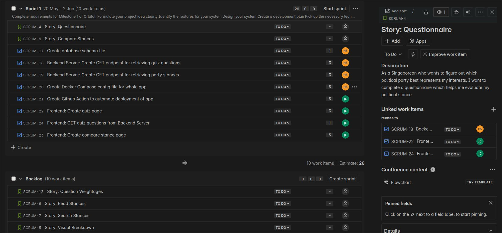

# Project Log
Will update this as we go, and clean this up for the submission on 2nd June. As it stands, it's just a rough outline.

## 20th May - Scrum initial meeting
We decided to go with Scrum as the framework of our development. To this effect, we did an initial meeting before we started the Sprint. We chose to use Jira to faciliate scrum processes, and we filled up the project backlog with user stories, and added the user stories we intended to complete this sprint.

We decided to keep the Sprint from now till the end of the milestone, which was about 2 weeks. We did a quick planning poker to set the story point estimations on the tasks that we assigned to sprint 1.

We decided to conduct daily scrums for 15 minutes every 5pm everyday, and with that we were ready to begin development.

## 21st May - First Daily Scrum
We held our first daily scrum. While discussing, we found that it was probably best to setup the docker compose files first and foremost so that our development environment would be standardized.

To that extent, I created the config file for the database, including the initial .sql file to initialize the tables of the database. I created an Entity Relationship Diagram to visualize how the database would look, so that everything was logical.

Thaddaeus started learning React in order to implement the frontend.

We also decided to use the [Github Flow](https://docs.github.com/en/get-started/using-github/github-flow) for our branching strategy.

## 22nd May
I started creating docker compose files for the database. I also began on the first feature of the backend, the GET endpoint for quiz questions. I followed TDD, creating a test suite using Jest for Node. I created some unit tests.

## 23rd May
I created an integration test that would spin up the docker instances and then query the endpoint, ensuring that the correct result was outputted. With the test cases done, I began implementing the feature. Upon doing so, I realized some issues with the integration test - particularly, the setup script wasn't working well and the test would run before the servers were even ready. However, as I would be following this template for future tests, this was a problem I only had to fix once. I believe now the TDD workflow will be smoother. After fixing the test case and coding the feature, I pushed to the branch
