<h1 align=center>Milestone 1 Submission</h1>

# Team Name:
Tharjun

# Level of Achievement:
Apollo

# Motivation
The Singapore General Elections recently completed. From conversations with friends and discourse online, we have found out that some voters are left unsure on how parties represent their interests. We have also noticed that there were not much great resources on choosing a party in Singapore. 

As first time voters in GE2025, we too felt loss when navigating Singapore's political sphere. This issue likely arose as politics has never been a regular topic of discussion for us. In fact, a significant population of Singaporeans are just like us. A study by the Institute of Policy Studies (2021) found that nearly 40% of Singaporeans never discuss politics, reflecting widespread political apathy and low engagement. Furthermore, a YouGov survey (2025) found that GenZ voters were especially undecided going into the election, with only 30% of them having decided on who they were going to vote for.

These statistics clearly highlight a growing disconnect been Singapore's youngest eligible voting generation with its political landscape. It is this very disconnect can and will weaken democratic participation. A strong democracy thrives on deliberate participation by informed voters. Understanding and valuing our vote is essential—it's how we shape national decisions, hold leaders accountable, and ensure our voices are heard.

From there, the motivation behind the project was born: to provide an extremely simple way for anybody, regardless of how versed they are in local politics, to find out which party best represents them. We decided that this would be easiest in a quiz-style app where users answer questions on pertinent issues in Singapore today.

# Aim
We were inspired by Germany's [Wahl-o-mat](https://www.wahl-o-mat.de/bundestagswahl2025/app/main_app.html), a tool for anyone to use to see how Germany's political parties compare. We thus would like to make a similar tool, a website that anyone may access online. It thus would be in a quiz-like format. There would be a breakdown of party stances at the end of the quiz.

# User Stories
1. As a Singaporean who wants to figure out which political party best represents my interests, I want to complete a questionnaire which helps me evaluate my political stance by covering the most relevant political views.
2. As a Singaporean who wants to figure out which political party best represents my interest, I want to view a comparison of my stances against the various political parties
3. As a Singaporean who wants to figure out which political party best represents my interests, I want to weigh questions which I feel stronger about heavier, so that the party breakdown is accurate.
4. As a Singaporean who wants to figure out which political party best represents my interest, I want to read about the positions parties have on issues.
5. As a Singaporean who wants to figure out which political party best represents my interest, I want to search for particular issues and view parties’ stances on them
6. As a Singaporean who wants to figure out which political party best represents my interest, I want to see a visual breakdown for which parties’ issues I best align with so that I can make a more informed decision when voting.
7. As a Singaporean who wants to figure out which political party best represents my interest, I want to read up-to-date stances of political parties on various topics
8. As a Singaporean who wants to figure out which political party best represents my interest, I want to include bonus questions to add more issues that I care about that are not in the core set of questions.
9. As an Admin, I want to login to the dashboard so that I may make changes
10. As an admin, I want to view all the questions that are in the questionnaire so that I may manage them if required.
11. As an admin who wants to keep the site relevant and updated, I want to be able to update the set of questions in the app to ensure its validity and relevance.
12. As an admin who wants accurate updated stances in the database, I want to approve or deny stances which are relevant and valid.

# Features
## Core Feat 1: Questionnaire
### Proposed Feature
The proposed feature is the main questionnaire that the user would complete before finding out their alignments with the parties. The user would be shown a question, and they could either agree, disagree, or skip. There would be controls to go to the previous question and next if applicable. There would also be a checkbox for users to assign 2 times weightage to the question, and lastly a progress bar to show the user's progress.

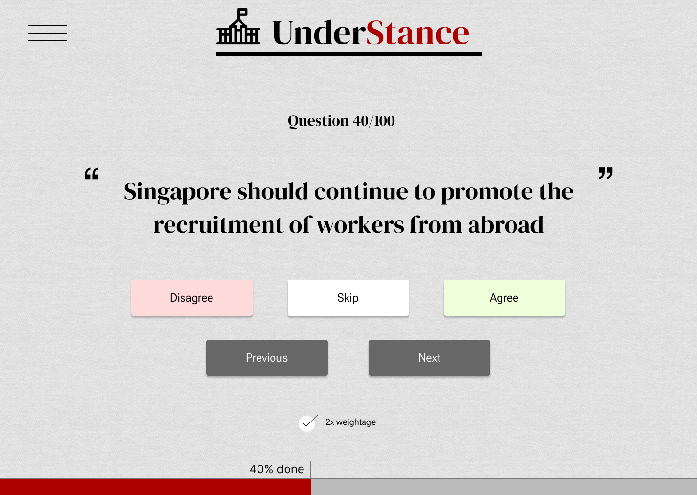

### Current Progress
For Milestone 1, the quiz page is functional. Users can agree/disagree/skip, and the previous/next controls are functioning as well. Yet to be finished are the 2x weightage options and the progress bar. Additionally, work is to be done on making the frontend look 1:1 with our Figma designs and making the page mobile-friendly.

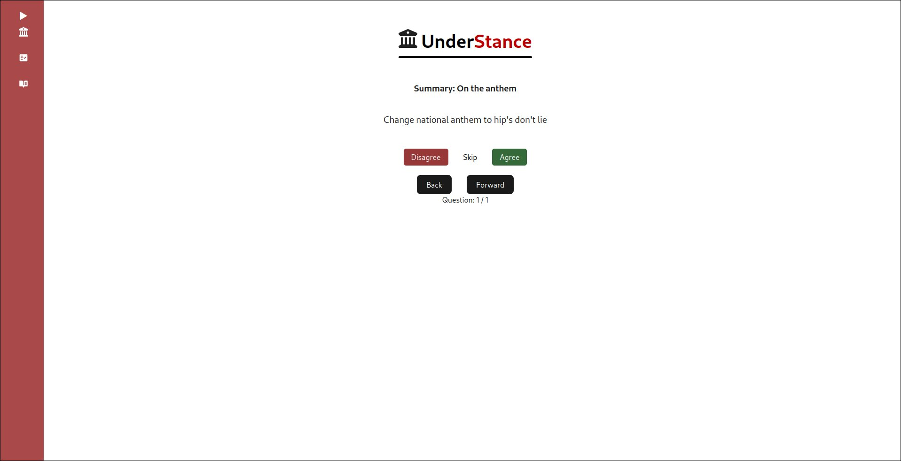

## Core Feat 2: Party Breakdown
### Proposed Feature
This feature would be displayed upon completing the quiz. It would involve a bar chart showing how the parties' stances compare, sorted in descending order. Additionally, scrolling down would show  an issue-by-issue breakdown on their stances, and whether they agree or disagree. This section would also involve more detailed party responses for users to understand their points of view.

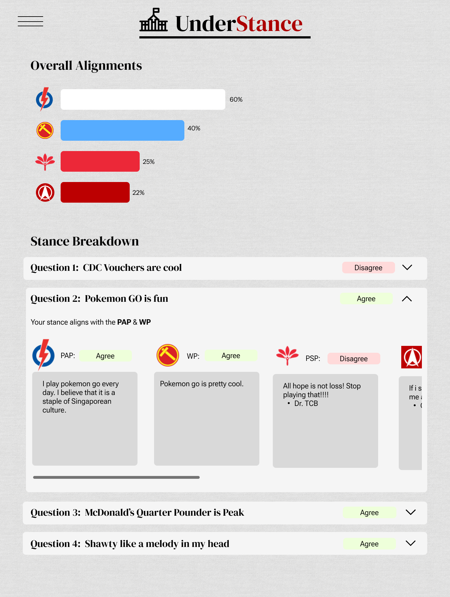

## Current Progress
The bar chart showing how the stances compare is complete, along with the issue-by-issue breakdown. Similarly to above, work is to be done on making the page mobile-friendly and implementing the Figma design as above.

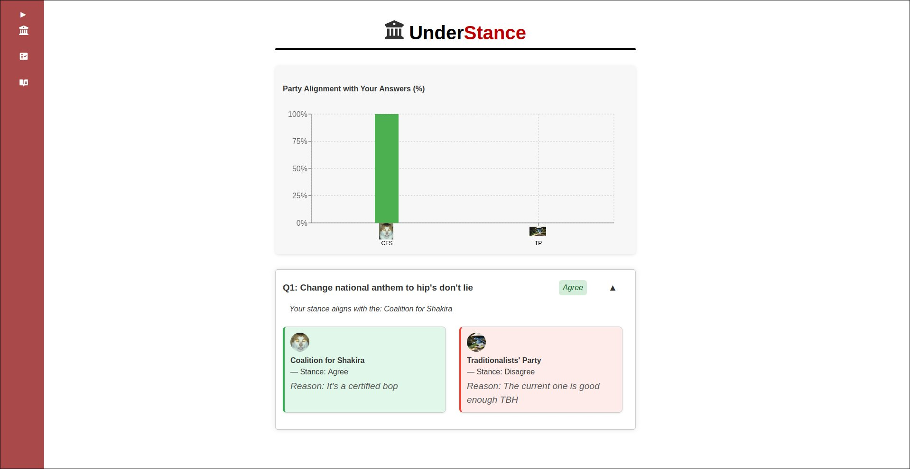

## Core Feat 3: Read Stances
### Proposed Feature
This feature would allow any user, regardless if they have finished the quiz or not, to read on the stances that the parties have on the issues in the quiz. It would simply show the issue in question, and then the response of the party and their overall stance. The page would additionally have a search bar.

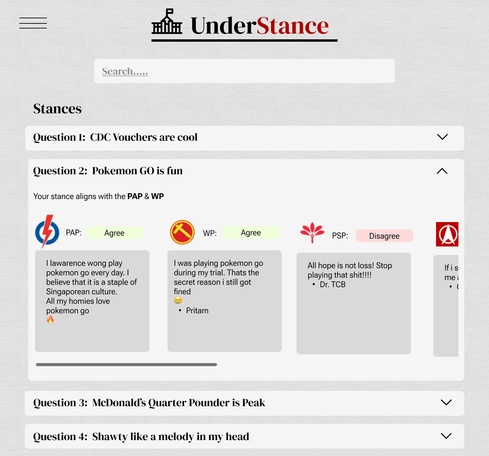

### Current Progress
The basic page is complete. Yet to be implemented are the search bars and styling for mobile.

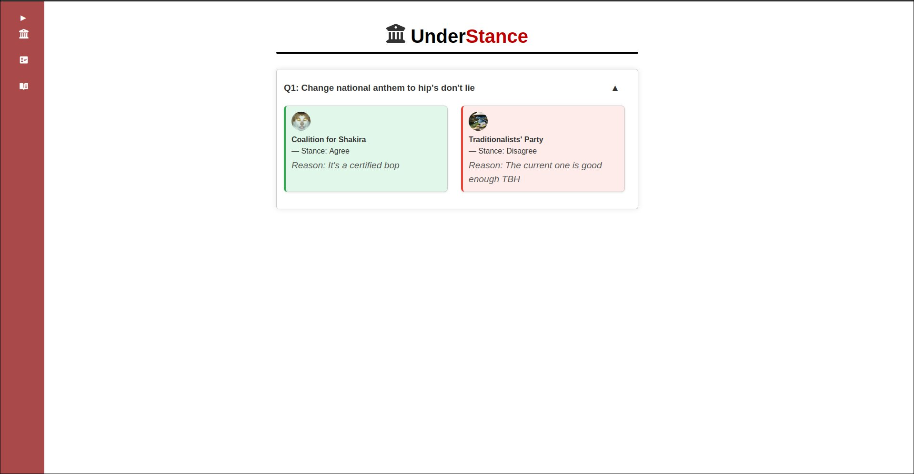

## Core Feat 4: Admin Dashboard
### Proposed Feature
The admin dashboard would be its own page requiring authentication to access. The dashboard will support standard CRUD operations on the various items in the database such as issues and stances. This will allow proper management of the quiz

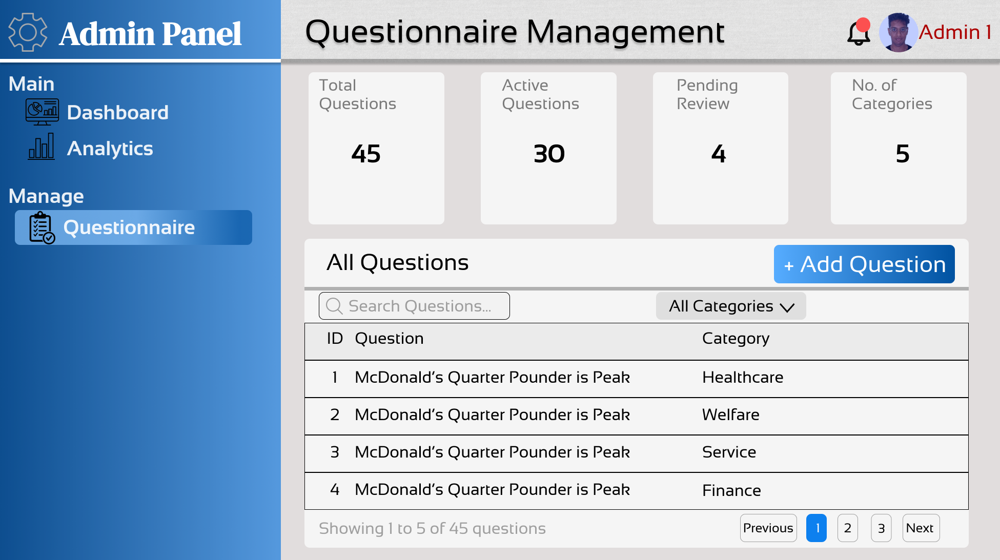

### Current Progress
As of milestone 1, this feature was not worked on yet.

## Extension Feat 1: Automatic stance extraction
### Proposed Feature
This proposed feature is to automate extraction of party stances from online sources. This will be done by utilizing web scraping to obtain data on parties from sources such as news sites or manifestos, thereafter passing the data to an AI agent for it to glean stances from. After doing so, the agent would be able to suggest/insert stances and issues into the database for approval.

### Current Progress
As of milestone 1, this feature was not worked on yet.

## Extension Feat 2: Approve/Deny automatic stances
### Proposed Feature
This addition to the dashboard would allow admins to view the AI-inserted stances/issues. It would allow them to verify its accuracy and relevance, and then either approve them or reject them. Approved issues would go into the "Bonus questions" pool, a separate pool of questions that users may choose to include along with the core set of questions.

### Current Progress
As of milestone 1, this feature was not worked on yet.

## Extension Feat 3: Add Bonus Questions
### Proposed Feature
This feature would allow users, before doing the questionaire, to view the bonus questions and choose to include them. They would be allowed to select any amount of questions they want.

### Current Progress
As of milestone 1, this feature was not worked on yet.

# Timeline
As we are using Scrum, deadlines are not assigned on a task-basis. Instead, they were assigned for sprints, each sprint being 2 weeks. The milestone submission deadlines are still in-place. For upcoming milestones and sprints, sprint planning meetings will be held to decide which items in backlog will be included in the sprint. Backlog refinement will also be done to further distill features into tasks for optimal splitting of work (e.g. Dashboard login to be split into Backend implement auth and frontend create page)

<table style="border-collapse:collapse;border-color:#aaa;border-spacing:0" class="tg"><thead>
<tr><th style="background-color:#f38630;border-color:inherit;border-style:solid;border-width:1px;color:#fff;font-family:Arial, sans-serif;font-size:14px;font-weight:normal;overflow:hidden;padding:10px 5px;text-align:right;vertical-align:top;word-break:normal">Sprint #</th><th style="background-color:#f38630;border-color:inherit;border-style:solid;border-width:1px;color:#fff;font-family:Arial, sans-serif;font-size:14px;font-weight:normal;overflow:hidden;padding:10px 5px;text-align:left;vertical-align:top;word-break:normal">Task</th><th style="background-color:#f38630;border-color:inherit;border-style:solid;border-width:1px;color:#fff;font-family:Arial, sans-serif;font-size:14px;font-weight:normal;overflow:hidden;padding:10px 5px;text-align:left;vertical-align:top;word-break:normal">Description</th>
<th style="background-color:#f38630;border-color:inherit;border-style:solid;border-width:1px;color:#fff;font-family:Arial, sans-serif;font-size:14px;font-weight:normal;overflow:hidden;padding:10px 5px;text-align:left;vertical-align:top;word-break:normal">Assigned</th><th style="background-color:#f38630;border-color:inherit;border-style:solid;border-width:1px;color:#fff;font-family:Arial, sans-serif;font-size:14px;font-weight:normal;overflow:hidden;padding:10px 5px;text-align:left;vertical-align:top;word-break:normal">Deadline</th></tr>
</thead>
<tbody>
<tr><td style="background-color:#FCFBE3;border-color:inherit;border-style:solid;border-width:1px;color:#333;font-family:Arial, sans-serif;font-size:14px;overflow:hidden;padding:10px 5px;text-align:left;vertical-align:middle;word-break:normal" rowspan="10">#1</td><td style="background-color:#FCFBE3;border-color:inherit;border-style:solid;border-width:1px;color:#333;font-family:Arial, sans-serif;font-size:14px;overflow:hidden;padding:10px 5px;text-align:left;vertical-align:top;word-break:normal">Setup Database</td><td style="background-color:#FCFBE3;border-color:inherit;border-style:solid;border-width:1px;color:#333;font-family:Arial, sans-serif;font-size:14px;overflow:hidden;padding:10px 5px;text-align:left;vertical-align:top;word-break:normal">Create database schema, setup config for DB</td>
<td style="background-color:#FCFBE3;border-color:inherit;border-style:solid;border-width:1px;color:#333;font-family:Arial, sans-serif;font-size:14px;overflow:hidden;padding:10px 5px;text-align:left;vertical-align:top;word-break:normal">Arjun</td><td style="background-color:#FCFBE3;border-color:inherit;border-style:solid;border-width:1px;color:#333;font-family:Arial, sans-serif;font-size:14px;overflow:hidden;padding:10px 5px;text-align:left;vertical-align:middle;word-break:normal" rowspan="10">2nd June </td></tr>
<tr><td style="background-color:#fff;border-color:inherit;border-style:solid;border-width:1px;color:#333;font-family:Arial, sans-serif;font-size:14px;overflow:hidden;padding:10px 5px;text-align:left;vertical-align:top;word-break:normal">Backend: GET questions</td><td style="background-color:#fff;border-color:inherit;border-style:solid;border-width:1px;color:#333;font-family:Arial, sans-serif;font-size:14px;overflow:hidden;padding:10px 5px;text-align:left;vertical-align:top;word-break:normal">Create an endpoint in the Backend server to return the quiz questions</td><td style="background-color:#fff;border-color:inherit;border-style:solid;border-width:1px;color:#333;font-family:Arial, sans-serif;font-size:14px;overflow:hidden;padding:10px 5px;text-align:left;vertical-align:top;word-break:normal">Arjun</td></tr>
<tr><td style="background-color:#FCFBE3;border-color:inherit;border-style:solid;border-width:1px;color:#333;font-family:Arial, sans-serif;font-size:14px;overflow:hidden;padding:10px 5px;text-align:left;vertical-align:top;word-break:normal">Backend: GET stances</td><td style="background-color:#FCFBE3;border-color:inherit;border-style:solid;border-width:1px;color:#333;font-family:Arial, sans-serif;font-size:14px;overflow:hidden;padding:10px 5px;text-align:left;vertical-align:top;word-break:normal">Create an endpoint in the Backend server to return party stances for issues</td><td style="background-color:#FCFBE3;border-color:inherit;border-style:solid;border-width:1px;color:#333;font-family:Arial, sans-serif;font-size:14px;overflow:hidden;padding:10px 5px;text-align:left;vertical-align:top;word-break:normal">Arjun</td></tr>
<tr><td style="background-color:#fff;border-color:#aaa;border-style:solid;border-width:1px;color:#333;font-family:Arial, sans-serif;font-size:14px;overflow:hidden;padding:10px 5px;text-align:left;vertical-align:top;word-break:normal">Backend: GET party</td><td style="background-color:#fff;border-color:#aaa;border-style:solid;border-width:1px;color:#333;font-family:Arial, sans-serif;font-size:14px;overflow:hidden;padding:10px 5px;text-align:left;vertical-align:top;word-break:normal">Create an endpoint in the Backend server to return party information</td><td style="background-color:#fff;border-color:#aaa;border-style:solid;border-width:1px;color:#333;font-family:Arial, sans-serif;font-size:14px;overflow:hidden;padding:10px 5px;text-align:left;vertical-align:top;word-break:normal">Arjun</td></tr>
<tr><td style="background-color:#FCFBE3;border-color:inherit;border-style:solid;border-width:1px;color:#333;font-family:Arial, sans-serif;font-size:14px;overflow:hidden;padding:10px 5px;text-align:left;vertical-align:top;word-break:normal">Docker Compose config</td><td style="background-color:#FCFBE3;border-color:inherit;border-style:solid;border-width:1px;color:#333;font-family:Arial, sans-serif;font-size:14px;overflow:hidden;padding:10px 5px;text-align:left;vertical-align:top;word-break:normal">Create a docker compose config to spin up Backend, Database, Frontend </td><td style="background-color:#FCFBE3;border-color:inherit;border-style:solid;border-width:1px;color:#333;font-family:Arial, sans-serif;font-size:14px;overflow:hidden;padding:10px 5px;text-align:left;vertical-align:top;word-break:normal">Arjun</td></tr>
<tr><td style="background-color:#fff;border-color:inherit;border-style:solid;border-width:1px;color:#333;font-family:Arial, sans-serif;font-size:14px;overflow:hidden;padding:10px 5px;text-align:left;vertical-align:top;word-break:normal">Frontend: Quiz page</td><td style="background-color:#fff;border-color:inherit;border-style:solid;border-width:1px;color:#333;font-family:Arial, sans-serif;font-size:14px;overflow:hidden;padding:10px 5px;text-align:left;vertical-align:top;word-break:normal">Create a functional quiz page as per spec</td><td style="background-color:#fff;border-color:inherit;border-style:solid;border-width:1px;color:#333;font-family:Arial, sans-serif;font-size:14px;overflow:hidden;padding:10px 5px;text-align:left;vertical-align:top;word-break:normal">Thaddaeus</td></tr>
<tr><td style="background-color:#FCFBE3;border-color:#aaa;border-style:solid;border-width:1px;color:#333;font-family:Arial, sans-serif;font-size:14px;overflow:hidden;padding:10px 5px;text-align:left;vertical-align:top;word-break:normal">Frontend: Compare Stance page</td><td style="background-color:#FCFBE3;border-color:#aaa;border-style:solid;border-width:1px;color:#333;font-family:Arial, sans-serif;font-size:14px;overflow:hidden;padding:10px 5px;text-align:left;vertical-align:top;word-break:normal">Create the functional compare stance page as per spec</td><td style="background-color:#FCFBE3;border-color:#aaa;border-style:solid;border-width:1px;color:#333;font-family:Arial, sans-serif;font-size:14px;overflow:hidden;padding:10px 5px;text-align:left;vertical-align:top;word-break:normal">Thaddaeus</td></tr>
<tr><td style="background-color:#fff;border-color:#aaa;border-style:solid;border-width:1px;color:#333;font-family:Arial, sans-serif;font-size:14px;overflow:hidden;padding:10px 5px;text-align:left;vertical-align:top;word-break:normal">Frontend: Compare Stance page</td><td style="background-color:#fff;border-color:#aaa;border-style:solid;border-width:1px;color:#333;font-family:Arial, sans-serif;font-size:14px;overflow:hidden;padding:10px 5px;text-align:left;vertical-align:top;word-break:normal">Create the functional compare stance page as per spec</td><td style="background-color:#fff;border-color:#aaa;border-style:solid;border-width:1px;color:#333;font-family:Arial, sans-serif;font-size:14px;overflow:hidden;padding:10px 5px;text-align:left;vertical-align:top;word-break:normal">Thaddaeus</td></tr>
<tr><td style="background-color:#FCFBE3;border-color:#aaa;border-style:solid;border-width:1px;color:#333;font-family:Arial, sans-serif;font-size:14px;overflow:hidden;padding:10px 5px;text-align:left;vertical-align:top;word-break:normal">Frontend: Front page</td><td style="background-color:#FCFBE3;border-color:#aaa;border-style:solid;border-width:1px;color:#333;font-family:Arial, sans-serif;font-size:14px;overflow:hidden;padding:10px 5px;text-align:left;vertical-align:top;word-break:normal">Create basic front page</td><td style="background-color:#FCFBE3;border-color:#aaa;border-style:solid;border-width:1px;color:#333;font-family:Arial, sans-serif;font-size:14px;overflow:hidden;padding:10px 5px;text-align:left;vertical-align:top;word-break:normal">Thaddaeus</td></tr>
<tr><td style="background-color:#fff;border-color:#aaa;border-style:solid;border-width:1px;color:#333;font-family:Arial, sans-serif;font-size:14px;overflow:hidden;padding:10px 5px;text-align:left;vertical-align:top;word-break:normal">Github Actions</td><td style="background-color:#fff;border-color:#aaa;border-style:solid;border-width:1px;color:#333;font-family:Arial, sans-serif;font-size:14px;overflow:hidden;padding:10px 5px;text-align:left;vertical-align:top;word-break:normal">Create CI/CD workflow using github actions.</td><td style="background-color:#fff;border-color:#aaa;border-style:solid;border-width:1px;color:#333;font-family:Arial, sans-serif;font-size:14px;overflow:hidden;padding:10px 5px;text-align:left;vertical-align:top;word-break:normal">Thaddaeus</td></tr>
<tr><td style="background-color:#FCFBE3;border-color:#aaa;border-style:solid;border-width:1px;color:#333;font-family:Arial, sans-serif;font-size:14px;overflow:hidden;padding:10px 5px;text-align:left;vertical-align:top;word-break:normal" colspan="4"><b>MILESTONE 1</b> - Technical proof of concept to be done. Basic Functionality of quiz done, along with rudimentary breakdown of leanings. Backend set-up with database</td><td style="background-color:#FCFBE3;border-color:#aaa;border-style:solid;border-width:1px;color:#333;font-family:Arial, sans-serif;font-size:14px;overflow:hidden;padding:10px 5px;text-align:left;vertical-align:top;word-break:normal">2nd June</td></tr>
<tr><td style="background-color:#fff;border-color:#aaa;border-style:solid;border-width:1px;color:#333;font-family:Arial, sans-serif;font-size:14px;overflow:hidden;padding:10px 5px;text-align:left;vertical-align:middle;word-break:normal" rowspan="8">TBA</td><td style="background-color:#fff;border-color:#aaa;border-style:solid;border-width:1px;color:#333;font-family:Arial, sans-serif;font-size:14px;overflow:hidden;padding:10px 5px;text-align:left;vertical-align:top;word-break:normal">Question Weightages</td><td style="background-color:#fff;border-color:#aaa;border-style:solid;border-width:1px;color:#333;font-family:Arial, sans-serif;font-size:14px;overflow:hidden;padding:10px 5px;text-align:left;vertical-align:top;word-break:normal">Implement functional UI for increasing weightage to question</td>
<td style="background-color:#fff;border-color:#aaa;border-style:solid;border-width:1px;color:#333;font-family:Arial, sans-serif;font-size:14px;overflow:hidden;padding:10px 5px;text-align:left;vertical-align:middle;word-break:normal" rowspan="8">TBA</td><td style="background-color:#fff;border-color:#aaa;border-style:solid;border-width:1px;color:#333;font-family:Arial, sans-serif;font-size:14px;overflow:hidden;padding:10px 5px;text-align:left;vertical-align:middle;word-break:normal" rowspan="8">TBA</td></tr>
<tr><td style="background-color:#FCFBE3;border-color:#aaa;border-style:solid;border-width:1px;color:#333;font-family:Arial, sans-serif;font-size:14px;overflow:hidden;padding:10px 5px;text-align:left;vertical-align:top;word-break:normal">Search Stances</td><td style="background-color:#FCFBE3;border-color:#aaa;border-style:solid;border-width:1px;color:#333;font-family:Arial, sans-serif;font-size:14px;overflow:hidden;padding:10px 5px;text-align:left;vertical-align:top;word-break:normal">Implement search UI in read stances page to filter</td></tr>
<tr><td style="background-color:#fff;border-color:#aaa;border-style:solid;border-width:1px;color:#333;font-family:Arial, sans-serif;font-size:14px;overflow:hidden;padding:10px 5px;text-align:left;vertical-align:top;word-break:normal">Dashboard login</td><td style="background-color:#fff;border-color:#aaa;border-style:solid;border-width:1px;color:#333;font-family:Arial, sans-serif;font-size:14px;overflow:hidden;padding:10px 5px;text-align:left;vertical-align:top;word-break:normal">Implement login functionality for admin dashboard</td></tr>
<tr><td style="background-color:#FCFBE3;border-color:#aaa;border-style:solid;border-width:1px;color:#333;font-family:Arial, sans-serif;font-size:14px;overflow:hidden;padding:10px 5px;text-align:left;vertical-align:top;word-break:normal">Dashboard view questions</td><td style="background-color:#FCFBE3;border-color:#aaa;border-style:solid;border-width:1px;color:#333;font-family:Arial, sans-serif;font-size:14px;overflow:hidden;padding:10px 5px;text-align:left;vertical-align:top;word-break:normal">Implement a page to show all questions in the database</td></tr>
<tr><td style="background-color:#fff;border-color:#aaa;border-style:solid;border-width:1px;color:#333;font-family:Arial, sans-serif;font-size:14px;overflow:hidden;padding:10px 5px;text-align:left;vertical-align:top;word-break:normal">Dashboard update questions</td><td style="background-color:#fff;border-color:#aaa;border-style:solid;border-width:1px;color:#333;font-family:Arial, sans-serif;font-size:14px;overflow:hidden;padding:10px 5px;text-align:left;vertical-align:top;word-break:normal">Implement a page for admins to perform updates to questions</td></tr>
<tr><td style="background-color:#FCFBE3;border-color:#aaa;border-style:solid;border-width:1px;color:#333;font-family:Arial, sans-serif;font-size:14px;overflow:hidden;padding:10px 5px;text-align:left;vertical-align:top;word-break:normal">Stance Scraping</td><td style="background-color:#FCFBE3;border-color:#aaa;border-style:solid;border-width:1px;color:#333;font-family:Arial, sans-serif;font-size:14px;overflow:hidden;padding:10px 5px;text-align:left;vertical-align:top;word-break:normal">Implement stance scraping as per spec</td></tr>
<tr><td style="background-color:#fff;border-color:#aaa;border-style:solid;border-width:1px;color:#333;font-family:Arial, sans-serif;font-size:14px;overflow:hidden;padding:10px 5px;text-align:left;vertical-align:top;word-break:normal">Dashboard manage scraped qns</td><td style="background-color:#fff;border-color:#aaa;border-style:solid;border-width:1px;color:#333;font-family:Arial, sans-serif;font-size:14px;overflow:hidden;padding:10px 5px;text-align:left;vertical-align:top;word-break:normal">Implement a page for admins to manage scraped questions(approve/reject)</td></tr>
<tr><td style="background-color:#FCFBE3;border-color:#aaa;border-style:solid;border-width:1px;color:#333;font-family:Arial, sans-serif;font-size:14px;overflow:hidden;padding:10px 5px;text-align:left;vertical-align:top;word-break:normal">Include scraped qns</td><td style="background-color:#FCFBE3;border-color:#aaa;border-style:solid;border-width:1px;color:#333;font-family:Arial, sans-serif;font-size:14px;overflow:hidden;padding:10px 5px;text-align:left;vertical-align:top;word-break:normal">Implement a page in main app to include scraped questions for use</td></tr>
<tr><td style="background-color:#fff;border-color:#aaa;border-style:solid;border-width:1px;color:#333;font-family:Arial, sans-serif;font-size:14px;overflow:hidden;padding:10px 5px;text-align:left;vertical-align:top;word-break:normal" colspan="4"><b>MILESTONE 2</b> - Fully-fledged core system. Quiz fully featured with weightage. Breakdown of leanings is detailed. Backend API complete. Dashboard completely implemented.</td><td style="background-color:#fff;border-color:#aaa;border-style:solid;border-width:1px;color:#333;font-family:Arial, sans-serif;font-size:14px;overflow:hidden;padding:10px 5px;text-align:left;vertical-align:top;word-break:normal">30th June</td></tr>
<tr><td style="background-color:#FCFBE3;border-color:#aaa;border-style:solid;border-width:1px;color:#333;font-family:Arial, sans-serif;font-size:14px;overflow:hidden;padding:10px 5px;text-align:left;vertical-align:top;word-break:normal" colspan="4"><b>MILESTONE 3</b> - Extended system. Web scraping + AI component complete. Dashboard with bonus questions complete. </td><td style="background-color:#FCFBE3;border-color:#aaa;border-style:solid;border-width:1px;color:#333;font-family:Arial, sans-serif;font-size:14px;overflow:hidden;padding:10px 5px;text-align:left;vertical-align:top;word-break:normal">28th July</td></tr></tbody></table>

# Systems Design
To ensure our system was logical and flowed well, we created several diagrams.

## Sequence Diagram of main quiz flow
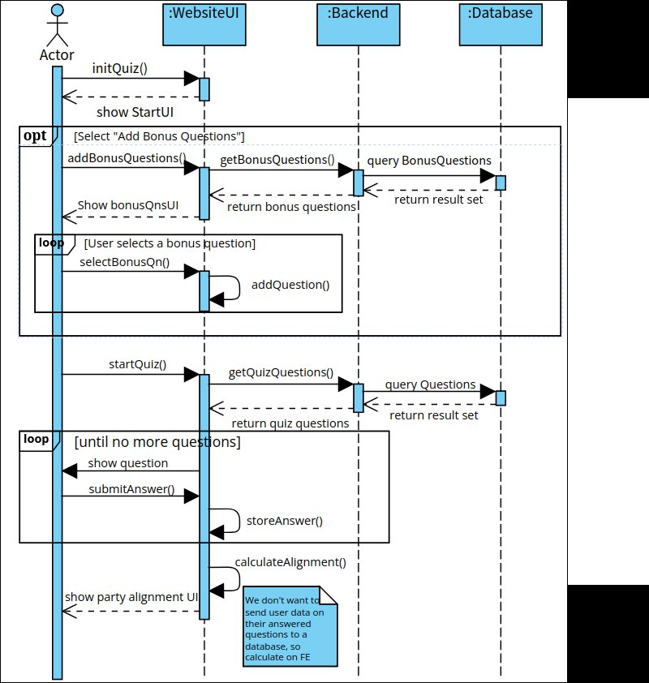

This sequence diagram shows the flow of how a user would initiate a quiz, complete the quiz, and then view their results. It additionally shows a key consideration we had when thinking of the idea - privacy. It was important to be transparent and trustable, that user data would not be leaked or sent anywhere as this could be a rather sensitive topic.

With this sequence diagram complete, it was easy for us to visualize how to implement the application.

## Entity Resource Diagram
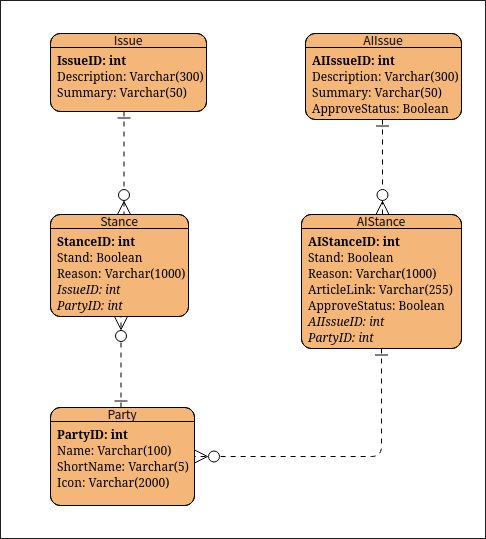

This entity resource diagram shows how the data is modelled. This was useful for database.

## Use case diagram
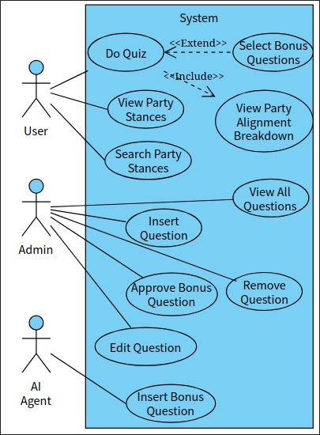

The use case diagram shows how different users interact with the system in different ways.

# Software Development & Practices
## Backend
For the Backend a strong emphasis on correctness was made, as it was important that any logic done on the data being sent out should be correct for the Frontend to use. As such, test-driven development was used from the onset to ensure code quality and correctness. Unit tests targeting individual components were made, mocking components that were dependencies. The unit tests cover >90% of lines in the backend app. Additionally, integration tests were made that would use docker compose to create minimal test environments. Queries would be run on these environments to ensure that the individual components worked together expectedly, and that the results returned were correct. These tests were integrated with CI scripts to ensure that a strong focus on testing would be maintained throughout the project.

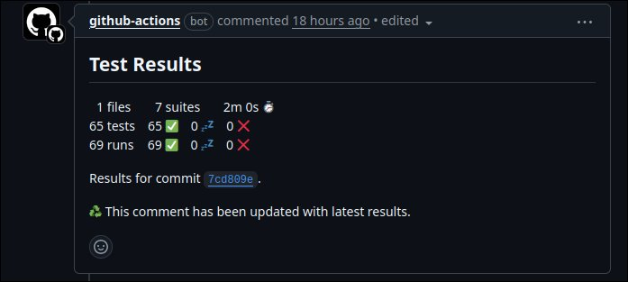

The Backend server was made using the ExpressJS framework. For accountability and error-tracking, the server was also set up with structured logging, logging errors to files and information to standard output.

## Frontend
For the Frontend, the primary focus was on delivering a Minimum Viable Product to allow early user feedback. As such, development was prioritised on speed and core functionality over exhaustive testing. In its stead, manual testing was done to ensure that the MVP was reliable. In further milestones, UI testing will be conducted using Jest. Furthermore, end to end testing will be conducted to ensure reliability of the system as a whole.

The Frontend was made using React.

## Code Quality
Code quality was maintined throughout the repository using formatters and linters. This ensures that the code is readable and maintains several coding standards. These tools are also run in workflows to ensure that any and all code in the main branch is up to standard.

## Version Control
Git was used for version control, with Github as the remote repository. Branch protections were set in place such that code cannot be directly commited to main - all changes must be done through pull requests. Additionally, code reviews must be done in Github before any pull request can be merged. To keep branches clean and well-organized, we followed the Github flow, naming our branches <#name>/JIRA-<#issueNumber>-<#briefDescription>.

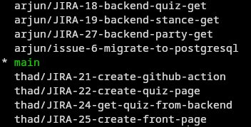
(Branches that I did not delete locally)

This reduced the cognitive load when switching between branches or reviewing pull requests, as the naming scheme and workflow made the development process easy to follow.

## Collaboration
As previously mentioned, we used Scrum with 2 week sprints as our collaborative framework. We conducted pre-sprint meetings, planning pokers, and daily scrums in our process for Milestone 1. We used JIRA to host our product backlog and conduct sprint planning.

Scrum has allowed us to set clear goals for Milestone 1, while leaving some flexibility on which developer does which task. Daily scrums kept us on-track and up-to-date regarding any pertinent information. It had also allowed us an avenue to clarify any doubts we had in specific implementation details with each other.

# External Documentation
The Backend component also has API documentation hosted on SwaggerHub, using the OpenAPI spec file located in the Backend folder. The documentation is [available publicly](https://app.swaggerhub.com/apis-docs/harjun7517/under-stance_backend_api/0.1.0)

# Project log
View the project log for Milestone 1 [on github here](https://github.com/Harjun751/UnderStance/blob/main/MilestoneSubmissions/Milestone1/ProjectLog.md)
